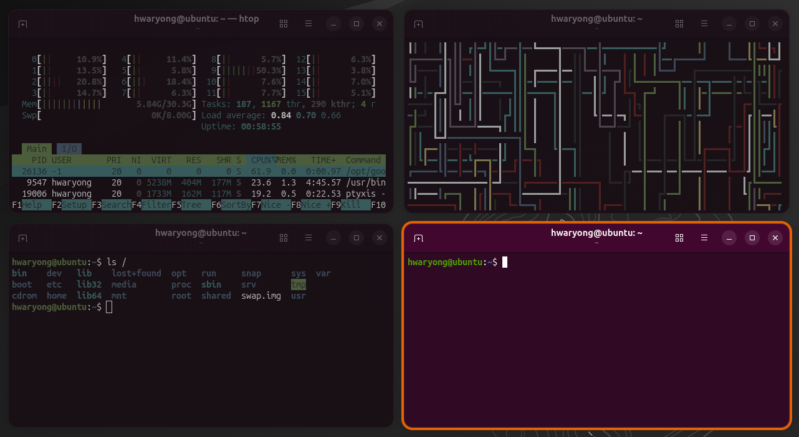

# Focus on Active Window

**Focus on Active Window** is a GNOME Shell extension that helps you focus on your task by dimming inactive windows and highlighting the active window with a customizable border.

It is designed with performance and aesthetics in mind, utilizing `bind_property` for lag-free border tracking and LibAdwaita for a native settings UI.


*(Please place your screenshot image in the repository and name it screenshot.png)*

## ✨ Features

- **Active Window Border**:
  - Highlights the focused window with a border.
  - Highly customizable: Width, Radius, and Color.
  - **System Accent Color Support**: Automatically syncs with your GNOME/Ubuntu theme color.
- **Inactive Window Styling**:
  - **Opacity**: Make background windows transparent.
  - **Dimming**: Darken inactive windows to reduce distraction.
  - **Desaturation**: Turn inactive windows into grayscale (black & white).
- **Performance Optimized**:
  - Uses `bind_property` for smooth, lag-free border movement during window drags and animations.
- **Compatibility Fixes**:
  - Correctly handles window shadows on Chrome/Electron apps (removes visual glitches).
  - Supports Dialogs and Modal windows.
- **Modern UI**: Settings window built with LibAdwaita for a native GNOME look.

## 📋 Requirements

- GNOME Shell **45** or later.

## 📦 Installation

### From GNOME Extensions Website
*(Link will be added once approved)*

### From Source

1. Clone this repository:
   ```bash
   git clone [https://github.com/YourUsername/focus-on-active-window.git](https://github.com/YourUsername/focus-on-active-window.git)
   ```

2. Move the folder to your extensions directory:
   ```bash
   # Remove existing installation if any
   rm -rf ~/.local/share/gnome-shell/extensions/focus-on-active-window@hwaryong.com

   # Install new version
   cp -r focus-on-active-window ~/.local/share/gnome-shell/extensions/focus-on-active-window@hwaryong.com
   ```

3. Log out and log back in (or restart GNOME Shell if on X11).

4. Enable the extension using **Extension Manager** or the command line:
   ```bash
   gnome-extensions enable focus-on-active-window@hwaryong.com
   ```

## ⚙️ Configuration

You can configure the extension via the **Extension Manager** app or **GNOME Extensions** app.

- **Border Settings**: Toggle border, choose custom color or system accent color, adjust width and radius.
- **Inactive Window Style**: Adjust Opacity, Darkness, and Desaturation using precise percentage (%) sliders.

## 👏 Acknowledgments

This extension stands on the shoulders of giants. Special thanks to:

- **[Tiling Shell](https://github.com/domferr/tilingshell)**: For the inspiration on high-performance border rendering logic using `bind_property`.
- **[Focus](https://github.com/scaryrawr/gnome-focus)**: For the core concepts of handling inactive window styling (opacity/desaturation).

## 🤝 Contributing

Contributions, issues, and feature requests are welcome!
Feel free to check the [issues page](https://github.com/YourUsername/focus-on-active-window/issues).

## 📝 License

Distributed under the GPL-3.0 License. See `LICENSE` for more information.